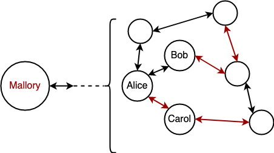

# The impacts of channel jamming

## Intro

Channel Jamming is often considered a big (and [old known](https://lists.linuxfoundation.org/pipermail/lightning-dev/2015-August/000135.html)) issue to the Lightning Network. In this series of posts, we aim to advance channel jamming research.

We think better understanding the threat of jamming is important because it allows to:

* better allocate protocol development engineering resources based on the priorities;
* make a better decision in mitigating channel jamming (compare the solutions; make sure a solution is not an overkill, etc.)

In this post, we identify and measure the harm jamming could cause.

## **DoS**

Channel Jamming attack is a type of Denial-of-Service, and the attacker’s goal is to disrupt victim’s operation efficiently.

In our work, we separately discuss targeting a single victim and harming the entire network. In Chapter 1, we discuss what an attacker may achieve in either case. In the Chapter 2, we will cover the attack costs.

The goal of a DoS attack is to prevent payments, either routed through the victim or paying the victim. The effectiveness of jamming thus could be characterized by the reduction of _payment\_success_ rate (either forwarding-related or acceptance-related), applied to the victim or the entire LN.

The focus of our work is observing how jamming could affect a victim's _payment\_success_ and finding ways to making it prohibitively expensive.

### Targeted DoS

Jamming payments towards a single node (or a small set of nodes) could be relevant in the following scenarios:

* a competing routing node interested in forwarding more payments instead of the victim and taking the fees;
* a competing merchant preventing the victim from selling goods or providing services.

    
     
    <i>Mallory jammed the channel between Alice and Bob/Caroll, the merchant nodes, to prevent the buying of services between them.</i>

We now discuss four concrete effects of jamming in more detail, _none of which have an easy mitigation_.

**Blocking/Stealing routing fees**

Lightning users run routing nodes to earn fees, and the amount they earn depends on the locked amount, their _payment\_success_, and certain forwarding properties (historical success rate, fee strategy, CLTV delta, etc.). Reducing _payment\_success_ reduces the earned fees (linearly with the current state of scoring algorithms).

Currently, the harm jamming achieves is only bounded by the attacker’s resources. In other words, it is theoretically possible to block all fees.

At the same time, the fraction of the fees that could be _stolen_ (by running parallel channels) is bounded by the external factors: e.g., routing algorithms used by payment senders.

**Routing reputation loss**

The BOLT specification allows payment senders to use arbitrary routing algorithms. Popular LN routing algorithms lean towards tracking the reputation of routing nodes based on the historic data (forwarding success rate),[ e.g in LDK](https://github.com/lightningdevkit/rust-lightning/pull/1625). Jamming could cause the victim’s channels to get penalized in terms of reduced reputation.

Protocol flexibility and future uncertainty make it hard to predict concrete impact of DoS on these reputation systems in the future, especially considering that the attacks could also be adapted.

**Disrupting business reputation**

Jamming could prevent a victim from accepting payments, which results in short-term opportunity losses and long-term business reputation losses. The exact losses depend on many business-related factors. With the ongoing deployment of many LSP and [specification of their services](https://github.com/BitcoinAndLightningLayerSpecs/lsp), operating business jamming-initiated disruption could become more concerning.

**Exhausting watchtower credits**

Watchtowers are likely to become an essential part of LN infrastructure supporting mobile clients, and thus watchtower credit would become an important resource. Frequently spamming victim’s channels (which is a special type of jamming) [could quickly exhaust](https://github.com/t-bast/lightning-docs/blob/master/spam-prevention.md#watchtower-credit-exhaustion) victim’s watchtower credits, since every state update could require a watchtower call and corresponding credit consumption.

### Network-wide DoS

An attacker may jam the entire network with the goal of compromising the LN and drag protocol users to other payment protocols, including fiat.

Ultimately, this attack would split the network into N partitions, in which payments can’t flow from one to another, so that the overall _payment\_success_ for payments _across partitions_ is reduced. These partitions could have either partial issues with communication, or being completely separated.

    
     
    <i>Mallory jammed the channels between the subnet Alice-Bob-Caroll and the rest of the network, therefore partitioning their ability to send payments across the subnets.</i>

In the end, the LN could lose credibility both from the transactors (because they can’t buy/sell goods and services reliably), and from the routing nodes (because they can’t earn fees reliably).

_We leave understanding whether a significant fraction of LN users would leave if network-wide payment_success goes down for further research. This could involve user surveys and observing real-world data (LN payment failure rate, channel closure mempool activity, on-chain payment increase, etc.), although the latter is complicated due to the privacy of the LN._

**Network-wide channel closures**

Apart from minimizing _payment\_success_, an attacker might seek to trigger many channel closures in response to a long-lasting network DoS.

This may be motivated by the attacker’s will to earn higher fees (as a miner), as a part of a larger attack that involves massive channel closures (e.g., [flood&loot](https://arxiv.org/abs/2006.08513)), or simply for bringing additional inconvenience and costs to the LN users.

_We are currently unaware of any LN implementations closing their payment channels in case jamming is detected or in case of significant payment success reduction, and we consider this scenario to be unlikely in the future. Combined with a social attack, however, this could pose more serious risks._

### Probing

Probing attack allows inferring channel balances by making dummy payments and observing whether they were successfully routed over the target. Usually, probes use binary search and terminate when a given precision is achieved.

It was [demonstrated](https://eprint.iacr.org/2021/384.pdf) that in many cases it is impossible to fully probe channels in the presence of parallel channels. This could be overcome by jamming these parallel channels leaving only one available, and then probing it (repeated for every channel).

Jamming could enhance probing both of a small set of targets and the entire network.

## **Conclusions**

In this Chapter we overviewed different types of harm channel jamming could impose.

We highlight the risks for individual LN users (loosing fees, getting routing reputation reduced and inability to do business) and LN as a whole (compromising the credibility, consequences of massive channel closures or extended payment censorship). We also mention that for both cases deanonymization via probing becomes more feasible.

In the following Chapter, we aim to measure the costs an attacker may bear to achieve their goals in _payment\_success_ reduction and probing enhancements.

