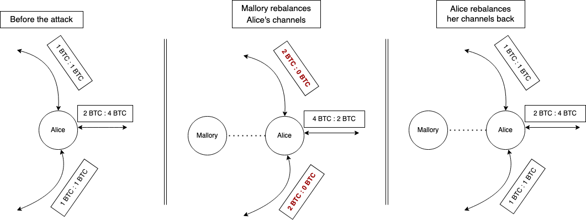
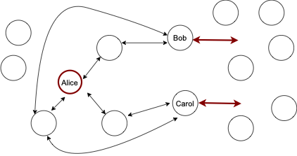
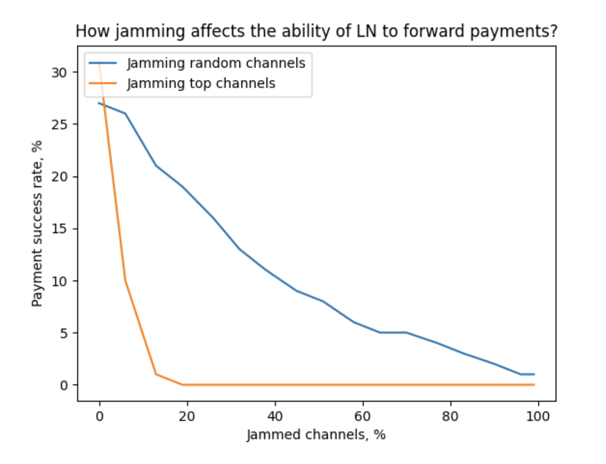

# Channel jamming costs

## Intro

In the previous chapter, we discussed the goals jamming may achieve. Now, we will look at the resources an attacker has to spend to achieve them; and how these resources could be minimized.

This is important to evaluate the feasibility of jamming attacks, as well as to evaluate the absolute efficiency of the potential solutions.

We make the following assumptions for simplicity:

* attacker’s channels are funded solely by the attacker (single-funded);
* when we say “a channel is jammed”, we mean that _one direction_ of that channel can’t be used for payment forwarding (for discussing disabling in both directions, it’s usually sufficient to just _multiply the costs by 2_);
* attacker uses slot jamming, as it is currently significantly cheaper than amount jamming, which is covered in Chapter 3.

**Jamming as a merchant**

Our analysis generally assumes an attacker uses an anonymous fresh identity and thus has to open channels and issue payments. Alternatively, a malicious popular merchant employs its position to jam target channels by routing incoming payments through them (via the “route hints” feature) and then manipulating those payments. A similar risk could be studied in the context of trampoline nodes.

This alternative attack introduces a new trade-off: a malicious merchant sacrifices with buyers’ time to make a payment (including failed attempts), to attack the LN or particular nodes.

_The cost/benefit analysis in these cases is different, as it would be focused on “how much of the personal reputation and economic gains an attacker is willing to sacrifice to make substantial harm to the competitors”. We leave studying these dynamics for future work._

## **Cost Aspects**

Assuming an attacker already has available BTC capital, these funds have to be locked in LN payment channels. It boils down to two cost aspects: on-chain fees and opportunity cost. Let’s discuss both in more detail.

### **On-chain fees**

Assuming the attacker is capable of batch-opening multiple channels in one transaction, the associated on-chain fees could be measured with the following formula:

`f1: opening_cost(N) = (N * 34 + 122) vbytes * 1sat/vbyte = 34 * N + 122 (sats)`

This calculation also assumes the minimal `1sat/vbyte` feerate, which can be achieved by opening the channels while fees are lower. Consistently high feerates make the attack proportionally more expensive, thus making the system more secure against these attacks. 

In our work, we assume low feerates in our further calculations, reflecting the current fee market.

### **Opportunity cost**

Once channels are opened, the attacker has to dedicate the locked funds for jamming and keep them busy for the attack duration.

The lower bound for the locked amount _per target channel_ is defined by the following factors (the largest of them):

* `htlc_minimum_msat * 483`, so that one attacker’s channel is sufficient to jam all slots of one target channel (e.g., `1*483 = 483 sats` in LND by default)
* routing fees associated with forwarding jamming payments (e.g., 483 sats in LND by default with their [basefee](https://github.com/lightningnetwork/lnd/blob/master/sample-lnd.conf); the cost is higher if the jamming payment requires multiple hops)
* minimum channel capacity an honest node in the network would agree to while opening a channel (e.g., 20,000 sats in LND by default).

Given that the latter aspect is currently dominating, the opportunity cost could be measured as follows:

`f2: opportunity_cost(N) = T * interest_rate * N * 20,000 (sats)`

For example, given the monthly interest rate of 1%, owning one minimal attack channel would cost 200 sats a month, and it would allow jamming at least one channel for this period.

Now, let’s discuss how this could be optimized even further.

### **Cost optimizations and complications**

**Optimization: Looping**

LN payment length is bound by implementation details, and we will refer to the maximum length as max_hops. Since this value is higher than the length an attacker usually needs to reach one target, an attacker can use one HTLC slot to lock multiple target slots. If the path is looped, an attacker can lock several slots of one channel.

For example, if max_hops=20, after dedicating 2 slots to the first and the last hop, an attacker could use the remaining 18 slots for the attack.

**Optimization: rebalancing targets**

Rebalancing the target channel is an honest activity that may achieve the same goals: reduce _payment_success_ for paying over certain channels.

    
     
    <i>A straightforward rebalancing won’t be effective because a victim could rebalance back these channels as easily. In fact, some implementations already do this.
</i>

However, if a victim doesn’t rebalance back their channels **immediately**, an attacker may use this to reduce the attack cost.

For example in Figure 2, if Mallory rebalances Alice’s channels, she has to jam only one channel instead of three, which disables **all** of Alice’s channels while jamming only one.

Cost-wise, this optimization reduces the number of channel openings at the cost of routing rebalance payments.

Let’s now assume that every four channels could be emptied towards the fifth channel. Then, the cost could be computed with the following formula:

`f3: rebalancing_cost(capacity) = capacity * percent_fee + base_fee`

`f4: cost_with_rebalancing(N, capacity) = opening_cost(N/5) + opportunity_cost(N/5) + rebalancing_cost(capacity)`

It becomes apparent that this optimization makes sense when the opportunity for rebalancing is high enough to justify routing fees.

In any case, we believe that an attacker won’t apply this optimization because:

* the vast majority of LN nodes (potential targets) have fewer than three channels, making this optimization useless;
* for the remaining nodes, the optimization gives very little benefit while transaction fees are low (and it’s not even guaranteed to work).

_We thus won’t apply this optimization for our further measurements, although it could be useful in the future where channel opening costs grow faster than routing fees._

**Optimization: targeting the surroundings**

Instead of jamming/rebalancing target channels directly, the attacker may identify the bottlenecks surrounding the target and jam/rebalance them.

    
     
    <i>Rebalancing the surroundings
</i>

Arguably, this scenario is even more harmful, because the victim would take longer to detect the attack, and applying some of the countermeasures may be more difficult. Similarly, this could be used to reduce the quality of the topology.

_In any case, we leave particular estimates of this attack for future work, as it requires substantial research (especially w.r.t. route blinding)._

## **Attack costs and gains**

### **The cost of attacking a small set of nodes**

If the attacker targets a routing node or a merchant, jamming their channels directly is the most efficient strategy.

These channels can’t be chained since they share a vertex. At best (for the attacker) they could be a part of three-hop circuits so that one attacker’s channel can jam 6 victim channels, assuming looping is used.

If we then assume most nodes/merchants have less than 6 channels, it would be sufficient for the attacker to have one channel to jam a victim entirely. In other words, the cost of jamming most of the routing nodes and victims is 156 sats (see f1) for opening and 200 sats/month in opportunity cost (see f2).

The most powerful routing nodes would have way more than 6 channels. According to [1ml.com data](https://1ml.com/node?order=capacity), nodes with the highest capacity usually have 200+ channels. Attacking 200 channels would cost 5200 sats and 6700 sats/month in opportunity cost.

_For these well-connected nodes, **rebalance-and-jam** could be used to optimize these costs even further. However, given the already low cost of this attack, we omit this optimization in this case._

### **The cost of attacking the entire network**

In this section, we estimate the cost of reducing the network-wide payment_success by jamming a large number of routing nodes. We use a small subset of [s-tikhomirov/ln-probing-simulator](https://github.com/s-tikhomirov/ln-probing-simulator) features to model the network in the following way:

* network graph snapshot from our Core Lightning node, with channel balances assigned as random(0, capacity)
* 50% of the balance is not available (to model in-flight payment flow activity)
* every payment has a 10% chance to fail at every hop (to model failures unrelated to liquidity)

We model 100 payments from a source node (connected to 3 random well-connected nodes) towards random recipients over 10 shortest paths and observe _payment_success_. Then, we repeat the experiment with some channels jammed, according to two strategies: jamming random channels and jamming top channels (considering their location in the topology).

    

According to our measurements, advanced target selection allows making the network almost unusable by jamming 20% of the channels (~14,000 channels).

With the estimates above and looping, this would require between 14,000/6=2334 and 14,000 attacker’s channels. The cost would be between

* ~80,000 sats + 470,000 sats/month in opportunity cost
* ~480,000 sats + 2,820,000 sats/month in opportunity cost

### **Stealing the fees**

The opportunities to steal routing fees fluctuate by many factors, which are difficult to evaluate comprehensively. It’s unlikely that stealing fees could be a sufficient goal for a long-term attack: an attacker becomes a target for the very same attack. However, stealing fees could indeed partially compensate the attack cost when the goal is different.

_Considering the rapid evolvement of routing algorithms in the network, and the complexity of such experiment, we decided to not attempt measuring which fraction of fees could be stolen. We leave this question for future research._

### **Other gains**

An attacker may use targeted jamming to hijack the purchases of goods and services. For example, if an attacker provides access to a VPN for Lightning payments, it could jam its competitors so that all consumers use the attacker's services. This applies to any [substitute goods](https://en.wikipedia.org/wiki/Substitute_good).

Miners could use jamming to attack the LN, so that users are forced to use on-chain payments, assuming they reasonably substitute off-chain payments. This could also apply to any alternative payment providers (cryptocurrency, fiat).

These kinds of gains should be evaluated on an individual basis. Unlike stealing fees, these likely could be a first-order goal of an attacker.

## **Conclusions**

In this Chapter, we identified that the attack cost only depends on the number of targets, but not on their sizes. We measured the costs of attacking individual nodes of different sizes, as well as the network as whole in detail. We also noticed that successfully stealing routing fees could significantly reduce the attack cost.
