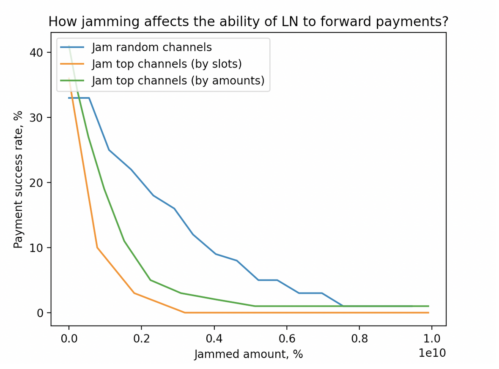

# Incremental solutions to channel jamming

## **Intro**

In previous chapters, we demonstrated what can be achieved with jamming, and at what cost.

Now, we will overview some straightforward ideas for reducing the attack efficiency without significant protocol modifications (or even deployed by node operators individually).

More specifically, we focus on preventing slot jamming, which makes the attack so cheap. These solutions could presumably force an attacker to use amount jamming instead, which we demonstrate is more expensive.

## **Solution 1: JIT Transaction Staging**

Slot jamming is possible because it is not secure for one channel to carry more than 483 in-flight HTLCs in a given direction, since exceeding it would make a commitment transaction too large and invalid.

Payment channel structure could be changed to bypass this bound by using a tree of commitments. Two-staged transaction construction would allow raising the HTLC limit to `483 * 483 = 233,289 slots`.

On itself, this solution is not an improvement, because an attacker would get the same benefit as the victim. It could even make an attacker more advantageous, if they use this optimization while victims don’t.

However, this technique _could_ enhance other Slot Bucketing defence, which we present later in this chapter.

This solution also comes with the following disadvantages:

* force-closing becomes 483 times more expensive (in the worst case)
* safety timelocks should be expanded considering that two transactions have to be confirmed (slightly reducing funds velocity)
* it requires substantial changes to the LN software critical subsystems (which were subject to funds-loss bugs [previously](https://lists.linuxfoundation.org/pipermail/lightning-dev/2022-April/003561.html))

## **Solution 2: Active defense**

Once the jamming is detected, a victim could open more channels, so that their operations are not disrupted. While this could limit the harm w.r.t. merchant activities, opportunity losses in terms of the locked capital remain.

At the same time, nothing prevents an attacker from jamming these newly created channels, resulting in a liquidity competition between an attacker and a victim. If there is a capital asymmetry in favor of the attacker, this protection is inefficient.

## **Solution 3: Slot bucketing**

The root cause of the slot jamming attacks is the limitation on the number of HTLC slots for payment forwarding on every channel, especially when all slots are “equal” in terms of the payment amount.

[Splitting the payments into amount-based buckets](https://github.com/lightning/bolts/issues/873) so that jamming high-volume payments at least requires locking an adequate amount may improve on this issue. Lower buckets should be allowed for high-value payments, but not the way around.

    
     
    <i>Bucket structure</i>

The jamming cost (of higher amount ranges) then becomes significantly higher, often to the point where it’s cheaper to apply amount jamming instead. The ultimate disadvantage of bucketing is a **cheaper cost of attacking payments from the lower buckets** because an attacker can apply slot jamming with fewer channels.

In this case, an efficient attack strategy would be slot jamming buckets one-by-one, starting with the lower buckets. This is equivalent to amount jamming several channels, capacity of which equals _slots * lower_bound._

It remains debatable whether LN ecosystem should strive to support low-value payments at the cost of lower security of high-value payments. Low-value payments could be valuable for the public image (micropayments) and facilitate selling granular digital services (API requests, streaming data, etc.). Ultimately, this could be decided by every routing node.

_We leave evaluating how this method works in practice for further research. The first iteration of this idea [in Eclair](https://github.com/ACINQ/eclair/pull/2330) could be used to provide initial insights._

**Payments below dust and 0-bucket policy**

A special cast of bucketing is handling below-dust HTLC values separately. Since these HTLCs could not be confirmed on-chain, applying the slot limits to them is meaningless in the first place. We advice routing nodes to keep a “0 bucket” not consuming slots from other payments.

By updating the measurements from the previous chapters, this method could easily increase the opportunity cost aspect of slot jamming (with looping) above-dust payments to:

`opportunity_cost (N) = T * interest_rate * (N * 473 / 6) * dust_limit = T * interest_rate * N * 43043 (sats)`,

assuming the `dust_limit=546 sats` for simplicity (although it [could be negotiated differently](https://github.com/lightning/bolts/blob/master/03-transactions.md#dust-limits)).

The size of “0 bucket” would be upper-bounded by two other parameters:

* ”how much a routing node can afford to lose from this HTLC forward risk”
* CPU/memory requirements to handle many in-flight HTLCs and prevent DoS

## **Targeted attack cost**

Now, let’s discuss the attack costs once 0-bucketing and/or slot bucketing is implemented.

First, we need to evaluate the cost of amount jamming, as it will be involved in further calculations.

### Amount jamming cost

The cost of opening N channels remains the same:

`opening_cost = (N * 34 + 122) vbytes * 1sat/vbyte = 34 N + 122 (sats)`

Notably, N for amount jamming would be lower, because an attacker is not limited by the 1-to-1 (or 1-to-20) attacker-victim ratio of HTLC slots.

The opportunity cost, in turn, could be computed as follows:

`opportunity_cost = T * (base_amount + base_amount * routing_percent_fee * hops) * interest_rate`

Since the percent_fee equals 0.032% ([Arcane Research](https://assets.ctfassets.net/4rilomtvvae4/4Q8jnXMVUDMovAY8hcpYkL/fb65b3290c8dcb23314aacb6f9b19be6/The_State_of_Lightning_Vol_2.pdf), page 19) and **not accounting for the locking duration**, the routing fee addendum can be dropped, and the opportunity cost could be reduced to the interest of using _base_amount_.

**A highlight of these equations is that the opportunity cost component becomes a dominant factor, and the attack cost becomes mainly dependent on the target capacity.**

### Slot jamming 0-bucket vs. amount jamming

First, let’s see under which conditions just implementing a 0-bucket would make the cost higher than the amount jamming cost. We have to solve the following inequation.

`slot_jamming_cost >= amount_jamming_cost` ⇒

`34 * N1 + 122 + T * interest_rate * N1 * 43044 > 34 * N2 + 122 + T * interest_rate * base_amount` ⇒

`34 * (N1 - N2) > T * interest_rate * (base_amount - N1 * 43044)` ⇒

`N1 - N2 > T * interest_rate * (base_amount - N1 * 43044) / 34`

For example, if a single channel is targeted (N1=N2=1):

`0 > T * interest_rate * (base_amount - 43044) / 34` ⇒

`base_amount < 43044 (sats).`

In other words, attacking one bucketed channel with less than 43044 sats makes amount jamming more efficient.

Alternatively, if 11 channels are targeted (N1 = 11, N2 = 1), and the attack length is one month (with 1% interest rate):

`10 > 1 * 0.01 * (base_amount - 473484) / 35` ⇒

`base_amount < 508484 (sats)`

In other words, 11 channels together should accumulate for less than 500,000 sats to make amount jamming more efficient than slot jamming a 0-bucketed channel.

**These examples demonstrate that for a large number of small/medium-capacity channels, the 0-bucket policy forces the attacker to use amount jamming.**

### The cost of slot jamming a bucketed channel

Let’s first assume three following optimizations are used:

* the victim uses JIT Transaction Staging to allocate extra 161 slot per bucket;
* the victim uses 0-bucket to increase the cost of attacking the first mentioned bucket (and we disregard below-dust payments for now);
* the attacker uses looping to reduce the cost by 9x.

The cost of attacking the channel in the figure above (according to the formula) would be:

* (disable payments) below 100,000 sats but above-dust: `546 (150 + 161) / 9 = 18,000 sats/month`
* (disable payments) below 1,000,000 sats: `100,000 * (150 + 161) / 9 = +3,455,555 sats/month`
* (disable payments) above 1,000,000 sats: `1,000,000 * (150 + 161) / 9 = +34,555,555 sats/month`

We omit the general formula here because it is sophisticated and largely depends on the specific bucket organization. Instead, we attempt to build up the intuition based on this concrete example, which demonstrates that, ultimately, **the attack cost with slot bucketing may be on par with amount jamming costs, if optimal bucketing is applied**.

## **Network-wide attack cost**

We repeated the experiment from Chapter 2, where we attempted to make LN payments fail by applying different jamming strategies and seeing how much liquidity an attacker has to commit (considering the model from previous section).

    

The most efficient strategy we implemented (top-by-amounts) allows for reducing _payment_success_ from ~35% to 3% while locking the amount equal to 20% of the network public amount.

The attack cost thus could be computed as:

`opportunity_cost = interest_rate * T * 0.2 * network_capacity`

We do not consider stealing fees as a way to compensate for the attack in this case.

_Assuming the 1% monthly interest rate and the current public capacity of 3000 BTC, it would cost 3.75 BTC/week to significantly reduce the throughput of the LN._

## **Conclusions**

In this Chapter, we overviewed several incremental techniques to mitigate channel jamming, among which Slot Bucketing is the most promising.

**Slot** **Bucketing** increases the bar of jamming substantial amounts of the LN. This measure makes the cost of targeted attack on par with amount jamming cost, and attacking the entire network requires locking 20-30% of the network capacity. The disadvantage is making it even cheaper to jam low-value payments, which may raise substantial concerns.

**0-bucket policy** is a special case of this defense, achieving the same goal in a limited way, but without negative consequences.

In the next Chapters, we will overview other, more fundamental solutions, and see whether their deployment could be justified.

