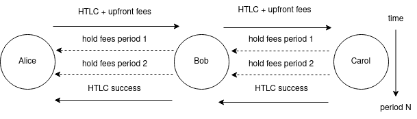

# **Chapter 5: Hold-time-dependent bidirectional fee schemes**

# **Intro**

_Hold-time-dependent bidirectional fee_ proposal resulted from an evolution of upfront payment schemes solving channel jamming.

This scheme bonds the payer to compensate routing nodes for the lengthy use of their capital while encouraging everyone to free the capital quickly. It is achieved by introducing a game-theoretic equilibrium based on the combination of two new types of fees.

In this Chapter, we briefly recall the protocol (thoroughly explained [here](https://lists.linuxfoundation.org/pipermail/lightning-dev/2021-February/002958.html)), and then analyze it’s efficiency and other properties to put it in the context of the solution design space.

## **The protocol**

Hold-time-dependent bidirectional fee protocol introduces two new types of fees and a grace period:

1. _upfront fees_ are paid at HTLC forwarding to the next hop, and assumed to cover locking funds of the routing hops within the _grace period _announced by the hops;
2. _hold fees_ are paid (periodically, based on ticks) to the previous hop after HTLC acceptance, and assumed to compensate for locking funds of the previous hops if the _grace period_ is exceeded.

_For simplicity, we assume that not paying hold fees in time immediately triggers a channel closure (could be achieved by a Service-Level Agreement between channel counterparties)._

    
     
    <i>Alice pays Carol through Bob. The upfront fee is paid at sending `update_add_htlc`. Once the HTLC is committed at each hop, the hold fees start getting paid periodically. After accepting the HTLC, Carol suspends further hold fee payouts by finalizing the payment.</i>

The combination of these two fees encourages routing nodes (and the payment recipient) to resolve the payment quickly.

Both fees somewhat rely on the goodwill of the participant:

- R1. if an upfront fee receiver closes the channel immediately after getting the fee, it gets away without bearing the cost of locking their funds;
- R2. if hold fees are not respected (e.g., hold fee payer does not honor payment; or a hold fee payee delays payment resolution to earn more fees), their supposed recipient could force-close the channel to minimize further uncompensated liquidity lockup.

R2 can take different forms: the last hop not paying the fee, or the [left hop simulating offliness](https://lists.linuxfoundation.org/pipermail/lightning-dev/2021-February/002965.html) to inflate the hold fee paid by the right side, making it even harder to reason about the risks.

For quick payments (e.g., a small CLTV), this goodwill is on par with the risks every node already bears: after opening a channel and paying the fees, a counterparty could close it right away, burning the opener’s resources (opening/closure fee, capital locked up).

However, for longer payments (either intentional or accidental), the risks become more substantial. This is because if a routing node accepted an HTLC and wasn’t able to forward it further (due to a non-responsive next hop), it would either lose the value at force-closing or wait for the entire CLTV period.

Now, let’s discuss this in more detail.

## **Solution efficiency**

Payment fees represent a conflict of interest between a payment sender (willing to pay fewer in upfront fees) and routing nodes (seeking for better guarantees), corresponding to the risks R1 and R2 above.

This type of solution is efficient if it:

* allows honest actors negotiate the conditions aligning their risks easily;
* makes it hard for an attacker (either jamming or another exploit) to succeed.

For example, risk-free routing operations, assumes a payer covering the entire liquidity lockup cost for the whole CLTV time in upfront fees to guarantee the safety of the first routing node, since hold-fees may not be reliable. 

We will now discuss why this configuration may be infeasible.

**Burden on honest users and asymmetry**

Unfortunately, the requirement to pay a substantial amount upfront is risky for honest payment senders in the presence of malicious routing nodes (or in the presence of non-zero ratio of failed payments). Thus, the parties would often seek for another risk balance satisfying both (e.g., paying a fraction upfront).

_It remains an open question whether this balance even could be found at all. If so, it would likely require an efficient reputation policy employed by routing nodes. E.g., if a certain payment sender has bad history of payments, it may be required to cover 100% in advance._

A reputation system could work in the opposite direction too: payment senders could assume that their trustworthy routing nodes would return a part of the upfront fee, if the payment is resolved quickly.

# **Discussion**

**Privacy**

We believe that hold-time-dependent bidirectional upfront fees proposal does not hurt privacy in any way:

* adding new fee fields to the channel announcements does not hurt the privacy of routing nodes, as it is just another fee;
* adding new payment metadata (fees) reveal (almost?) no new information about the payment destination, path length, etc.;
* both passive and active external observers do not get any new information about the pending/resulting state change over the channel getting observed;
* on-chain observers do not get any new information from channel closures (although this depends on the way new fees are implemented).

**Resource requirements**

The protocol adds the following overhead to the LN node operation:

* new fees have to be gossiped within the channel updates, resulting in additional 8 bytes per message (4 bytes for every new fee component), which is a minor part of the overall bandwidth;
* payment senders carry the burden of accounting for new fees while constructing the payment onion (easy) and making optimal routing decisions (could be hard).

The onion size remains unchanged.

**Compatibility**

Although neither trampoline nor offline-receive protocols are finalized, we believe those solutions could be made compatible with them. However, it could result in slight capital-efficiency reduction due to decision delegation/deferral).

## **Conclusion**

In this Chapter, we overviewed hold-time-dependent bidirectional upfront fee protocol and evaluated it.

We found out that using it would require finding a compromise between payment sender and routing nodes. We think that an efficient reputation policy may be a key requirement to making finding this compromise possible, especially in the world of lengthy payments. Although if the reputation approach is taken, the protocol presented in the next Chapter may be preferable.

We also concluded that this proposal does not hurt privacy of LN payments, does not add much overhead, and is compatible with discussed orthogonal routing proposals.

