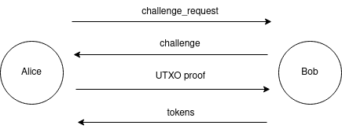
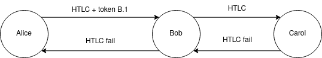

# **Chapter 6: The Reputation Scheme: Stake Certificates + Forwarding Pass**

# **Intro**

In this chapter, we discuss how a concrete reputation-based scheme could solve channel jamming. We propose a system based on Stake Certificates (an ID based on the zero-knowledge proof of UTXO ownership initially proposed on the [mailing list](https://lists.linuxfoundation.org/pipermail/lightning-dev/2020-November/002884.html)) and Forwarding Pass (a reputation issuance protocol initially authored by @Roasbeef to the best of our knowledge).

Historically, these two protocols were proposed separately. Each focused on only one aspect, leaving another one ambiguous. We argue that they would strongly benefit from each other. After describing both, we will discuss the efficiency of the combined solution and put it in the broader context.

## **Stakes Certificates: an ID based on the Zero-Knowledge proof of UTXO**

As we discussed in Chapter 4, the first component of a reputation system is an ID. Stake Certificates protocol suggests proving UTXO ownership in zero-knowledge for an ID in the following way:

1. The UTXO is part of the UTXO set at a defined time and restricted by the filter provided by the verifier (e.g., UTXO amount, freshness, Script content, etc.);
2. Prover knows the witness script of the UTXO;
3. Prover can construct a valid witness for the witness script;
4. A valid proof-of-UTXO ownership cannot be duplicated against the same prover.

Once a payer constructed a payment path, proofs for each routing hop may be constructed. The proof is linked to the routing node’s public key, to prevent proof reuse by thisrouting node.

    
     
    <i>Alice initiates the identity challenge request to Bob, the routing hop. Bob replies with a unique challenge to link the proof to a routing node secret (e.g the routing node’s private key). Alice generates a UTXO proof and sends to Bob, who verifies the correctness. If the proof is valid, Bob replied with reputation tokens. Communications can happen over onion messages channels or via other means. The exact number of rounds trips is function of the cryptosystems selected.</i>

Historically, the Stakes Certificate system was proposed as a standalone solution to jamming. However, the reputation tracking part was always ambiguous. The most straightforward way to implement it would be to track reputation solely based on a concrete UTXO. This would, unfortunately, allow a routing node to correlate payments from the same proof. To improve on this, we propose to combine Stake Certificates with Forwarding Pass, which we will now describe.

## **Forwarding Pass: Reputation Tokens as Routing Credit Units**

The second component of a reputation system is reputation algorithm. We suggest exchanging a proof-of-ID for a set of blinded tokens (used as credits for routing access) to make payments more private.

_Historically, Forwarding Pass protocol was oblivious of the type of ID. We believe that linking it to a scarce resource could give routing nodes a useful tool within a reputation function. In the simplest case, they could just require basic proof-of-any-UTXO, which any LN sender can meet since they own a payment channel. More advanced policies could lead to better results. In the efficiency section, we will discuss why this is useful in more detail._

Routing a payment through a given routing node would require including a token issued by that routing node in the payment onion. If a token is not included or is invalid, a routing node would reject forwarding the payment.

A payment sender has to receive a separate set of tokens from every routing node according to the routing node issuance policy. The policy is gossiped across the network within channel updates. The policy could take the following factors into account:

* a value of one token (how much capital one token allows to lock);
* token expiration (either specified at issuance time for every token, or uniform);
* ID evaluation function: how many tokens are issued given certain properties associated with the ID (e.g., the value and the freshness of the UTXO);

Tokens should be initially exchanged between the HTLC senders and a routing hop on the payment path by leveraging onion communication channels. To preserve payment anonymity, the exchange should be achieved through the usage of [blind signatures](https://en.wikipedia.org/wiki/Blind_signature), where the token is blindly signed by the hop at the provision of a valid identity and unblinded by the HTLC sender. \
 \
Afterwards, a set of blinded tokens is provided at HTLC forward and, in case of success only, signed by the hop and exchanged during the HTLC settlement phase, in replacement of the consumed ones.

    
     
    <i>Alice pays Carol through Bob. Token B.1 obtained by Alice from Bob previously is attached within the “Bob’s” layer of Alice’s HTLC onion. Since Carol is a recipient, no token is sent to her. Upon successful resolution, a finalization message is propagated backward. Bob signes B.2, a new token for Alice, replacing B.1.
</i>

    
     
    <i>Alice pays Carol through Bob. Token B.1 obtained by Alice from Bob previously is attached within the “Bob’s” layer of Alice’s HTLC onion. Since Carol is a recipient, no token is sent to her. Upon failed resolution, a finalization message is propagated backward, without a new token.</i>

The quality of a token issuance policy has a significant impact on the efficiency of this method against jamming.

## **Stake Certificates + Forwarding Pass**

The efficiency of a jamming solution is measured as the cost (e.g., reputation) of locking the capital of the routing nodes. In Chapter 4, we discussed how the cost of attack either should equal the opportunity cost and compensate the victims; or, alternatively, not compensate the victims but be substantially higher than the opportunity cost.

Reputation systems combine the two: they encourage the former by threatening with the latter. Thus, the attack cost should be as high as possible.

This cost, however, has another bound: since it might be difficult to distinguish a jamming attack from an honest case, this burden will end up on the honest users as well. This trade-off could supposedly be solved by good reputation policies.

Now, we will discuss three ways of obtaining reputation, and how routing nodes can balance them to make it suitable for honest users while preventing jamming.

### **Grinding/buying a new identity with a base reputation**

With Stake Certificates, the cost of obtaining a new identity with a base reputation fully depends on the reputation policy of a routing node.

First of all, routing nodes may or may not allow using channel funding UTXO (which every participant has) as an identity. Apart from that, the most straightforward case is buying a UTXO on the blockchain (e.g., an exchange), holding it for a certain time (as required by the policy), and then sell it.

The cost thus equals two transaction fees (to buy and to sell), and a potential loss due to the price difference between buying and selling, an exchange fee, and the opportunity cost of keeping the funds untouched. Given that the price difference is expected to be ~0 on average, and the on-chain fees could be optimized by low time preference, the opportunity cost is the major cost aspect.

A good protection means an attacker has to bear a substantially higher opportunity cost than the victim. Since the cost is the attacker’s opportunity cost, jamming X BTC over time T should require an attacker to lock `X*A BTC` (where `A >> 1`) over time T (or an equivalent), where A corresponds to the defence efficiency.

While a routing node indeed could enforce such a policy, it’s likely to be very unattractive for honest users. For example, if A=10, an DLC user would have to lock 10 BTC over a week before routing nodes agree to forward a DLC of 1 BTC over 2 hops.

**Burden on honest users and asymmetry**

There are two asymmetries between honest users and an attacker:

1. One attacker’s UTXO can generate tokens at N routing nodes (assuming they don’t communicate). An honest user could be interested in only `M &lt < N` routing nodes.
2. An attacker might use proofs/tokens secondary market, while we can’t assume honest users will.

These asymmetries have an unfortunate effect on the Stake Certificate value equilibrium: either the attack is too expensive, or the participation of an honest new user is too hard.

The asymmetry (1) could be solved as follows:

* allow bootstrapping of new honest users via some other means;
* pick a really efficient UTXO valuation policy to distinguish an attacker from honest users;
* information exchange between the routing nodes.

The asymmetry (2) could be, unfortunately, fundamental.

### **Grinding the actual reputation with honest activity**

Let’s now assume an attacker wants to honestly grind reputation to attack the system later. This process is associated with paying routing fees towards the target routing node.

To be “fair”, the jamming based on this honestly earned reputation should get a routing node fully compensated for the attack in previously paid fees. It is acceptable if an attacker doesn’t compensate the victim, but bears a much higher attack cost instead.

In any case, here comes the asymmetry again: a reputation system should find a sweet spot between benefiting honest users while limiting the attacker. This sweet spot should allow routing nodes to get a realistic chance for full compensation for liquidity lockups overall via serving honest senders at a reasonable cost, and avoiding attackers.

_We believe that in this case designing such reputation policy is possible._

### **Buying the actual reputation on a secondary market**

Let’s now consider a secondary market for reputation, which is **a matter of a good reputation policy**: it should provide honest senders with _just enough_ reputation for them, discouraging them from selling it on a secondary market.

However, some senders indeed would have more reputation than they need, and the secondary market could emerge. Similarly to buying a fresh reputation, we assume that an attacker might use this secondary market while honest users won’t.

Ultimately, the feasibility of this threat then depends on whether:

* a slack in reputation policy would be sufficient for a secondary market to develop;
* honest senders would refuse to sell on this secondary market, either by a cultural norm or due to the complexity;
* whether the secondary market solves the problem of double-spending routing tokens.

## **Discussion**

**Privacy**

We believe that the protocol does not leak privacy by analyzing its every aspect:

* A zero-knowledge proof of UTXO ownership makes the verifier completely oblivious of which of the allowed UTXOs is used. Assuming an adequate anonymity set (allowed UTXOs), this prevents the verifier from associating a UTXO with the prover;
* Tokens issued for the same proof are not linkable, and thus, does not allow correlating payments with different tokens of the same proof;
* Reissuing a token on payment success or burning it on payment failure prevents payment correlation caused by token reuse;
* Ideally, payment senders should obtain tokens in advance, so that routing nodes can’t correlate the payments with proving;
* A newly gossiped data (reputation policy) could theoretically leak something about the activity of a routing node, however, this is already the case with existing channel announcement gossip.

**Resource usage**

We believe that the protocol does not increase LN resource requirements significantly:

* extra bandwidth associated with gossiping reputation policy and communicating tokens is minor;
* onions won’t increase in size much after including tokens;
* the load of tracking senders’ reputation is on par with current LN operation;

The burden associated with ZK proving and verification depends on the cryptosystem.

**Compatibility**

It remains an open question how this protocol would be combined with trampoline payments. The protocol is likely to be compatible with offline receiving schemes because payees are not involved in the protocol.

# **Conclusion**

In this Chapter, we proposed a concrete reputation system for rate-limiting payments, to solve channel jamming. It is based on the combination of two existing ideas: Stake Certificates and Forwarding Pass.

The ultimate challenge is picking the reputation policy, which should be able to distinguish attackers from honest users.

This challenge applies both to the bootstrapping phase (generating a new ID) and grinding phase (earning the actual reputation).

